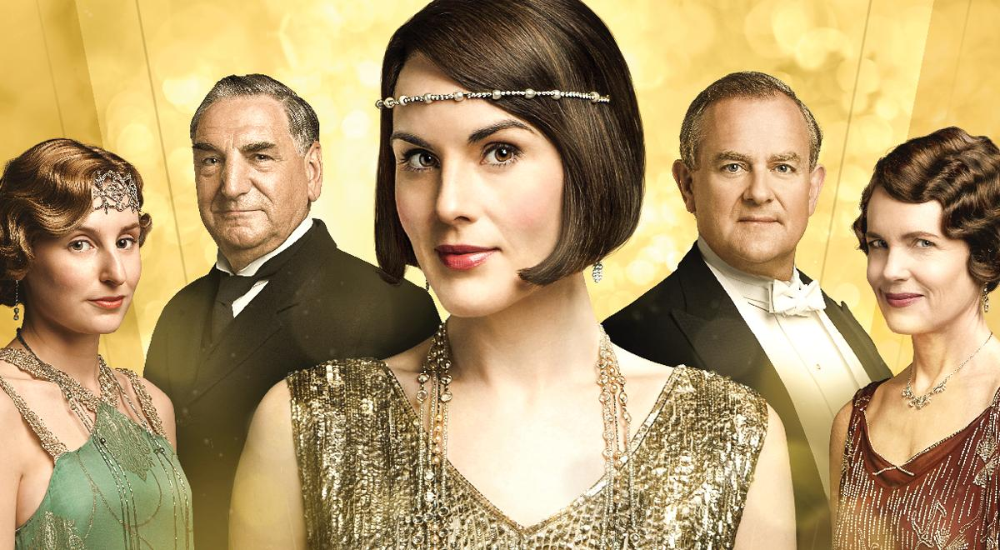

# Cloudinary's Guess the Transformation Challenge: Vue.js London 2019

### This challenge involves guessing a Cloudinary transformation URL that produces a given target image from one \(or more\) given source image\(s\).

## Source Images:

**Source image \#1:** [**https://res.cloudinary.com/demo/image/upload/downton-abbey-1.jpg**](https://res.cloudinary.com/demo/image/upload/downton-abbey-1.jpg)\*\*\*\*

**Source \#2:** [**https://res.cloudinary.com/demo/image/upload/downton-abbey-logo.jpg**](https://res.cloudinary.com/demo/image/upload/downton-abbey-logo.jpg)\*\*\*\*

## **W**arm-Up Transformation Example:

[**https://res.cloudinary.com/demo/image/upload/e\_tint:50:blue/l\_downton-abbey-logo,g\_south\_west,w\_250,h\_200/downton-abbey-1.jpg**](https://res.cloudinary.com/demo/image/upload/e_tint:50:blue/l_downton-abbey-logo,g_south_west,w_250,h_200/downton-abbey-1.jpg)\*\*\*\*

## NOW YOU TRY! 😀



